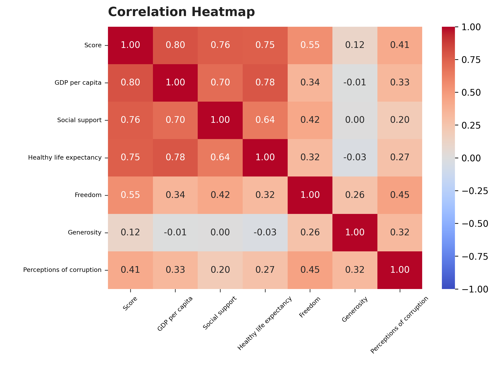
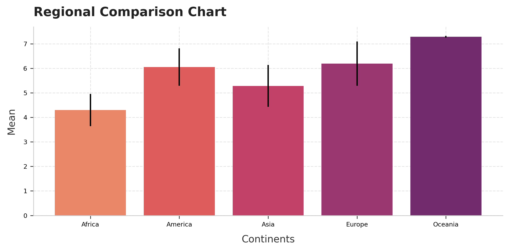
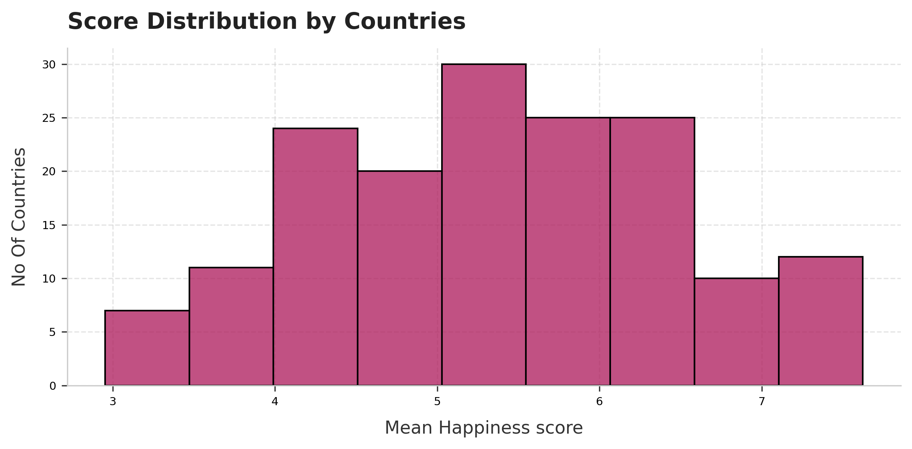
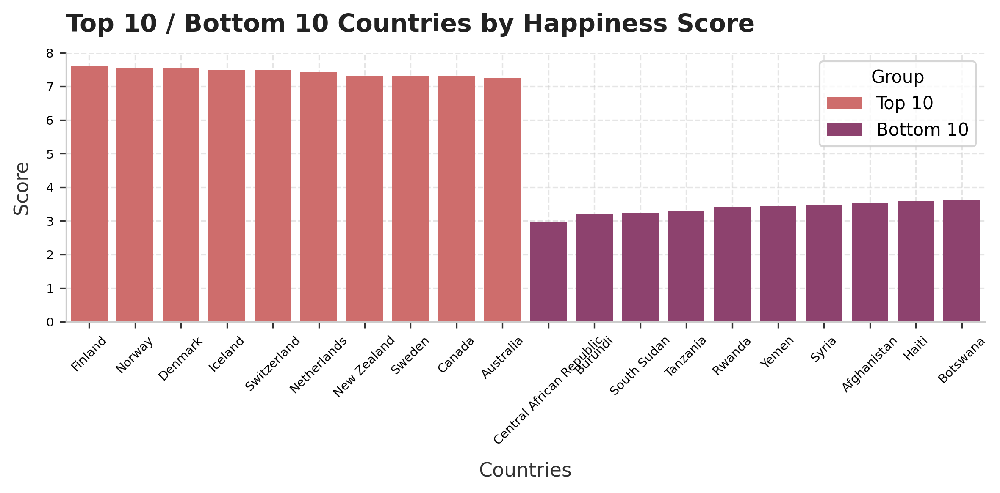

# Global Happiness & Well-Being Analysis
**Live Pakistan Data Analytics Internship (Week 2 of 4)**

Analysis of the World Happiness Report (2017–2019) to explore which socioeconomic factors correlate most strongly with national happiness scores, and to guide policy discussions for NGOs working on international development and well-being initiatives.


## Project Overview
This project analyzes 3 years of happiness survey data across ~164 countries to answer:
- Which socioeconomic factors are most strongly associated with national happiness?
- How does happiness compare across world regions?
- Which countries rank highest and lowest, and why?


## Repository Structure
```
├── data/
│   ├── raw/                # Original 2017, 2018, 2019 CSVs
│   └── processed/          # Cleaned & combined 3 year dataset
├── notebooks/
│   └── happiness_analysis.ipynb
├── visuals/
│   ├── correlation_heatmap.png
│   ├── regional_comparison_chart.png
│   ├── score_distribution_by_countries.png
│   └── Top_10_&_Bottom_10_Countries_by_Happiness_Score.png
├── reports/
│   └── insight_report.md
└── README.md
```

## Tools Used
- Python (pandas, NumPy)
- Matplotlib & Seaborn
- `country_converter` (country → continent mapping)


## Data Cleaning & Preparation
- Combined three separate yearly CSVs (2017, 2018, 2019) with inconsistent column names into a single long format dataset (467 rows)
- Standardized column names across years (e.g. `Happiness.Score` to `Score`, `Family` to `Social support`)
- Dropped 2017 only columns not present in later years (confidence intervals, Dystopia residual)
- Verified no duplicate country year records
- Filled 1 missing value (UAE, 2018, Perceptions of corruption) using the country's own average across 2017 and 2019
- Mapped each country to its continent using `country_converter` for regional analysis


## Visualizations
### 1. Correlation Heatmap
Shows the strength and direction of the relationship between each socioeconomic factor and happiness Score.



### 2. Regional Comparison Chart
Mean happiness Score by continent, with error bars showing standard deviation (internal consistency) within each region.



### 3. Score Distribution
Distribution of mean happiness Score (2017–2019 average) across all countries.



### 4. Top 10 / Bottom 10 Countries
The 10 happiest and 10 least happy countries by average Score across the three years.




## Key Findings
- **GDP per capita (0.80)**, **Social support (0.76)**, and **Healthy life expectancy (0.75)** show the strongest correlation with happiness Score.
- **Generosity (0.12)** is notably weak, it measures giving relative to income, not income itself, making it less directly tied to happiness.
- The top 3 factors are moderately correlated *with each other* (0.64–0.78), suggesting they overlap rather than acting as fully independent drivers.
- **Oceania** has the highest average Score (7.29) but is based on a small sample (6 records), interpret with caution.
- **Africa** has the lowest average Score (4.30), tied to widespread conflict, poverty, and instability.
- **Asia** shows the widest internal variation, reflecting its mix of wealthy and lower income nations.
- The happiest and least happy countries differ by more than double in Score, happiness is unevenly distributed globally.

Full written report: [`reports/insight_report.md`](reports/insight_report.md)


## Important Note
All relationships identified are **correlations, not causal claims**. Strong GDP is associated with higher happiness, but wealth alone does not guarantee it, it more likely enables the conditions (healthcare, social trust, freedom) under which happiness thrives.


## Author
**Beshair Khan**
- GitHub: [Beshair-Khan](https://github.com/Beshair-Khan)
- Linkedin: [Beshair-Khan](https://www.linkedin.com/in/beshair-khan/)